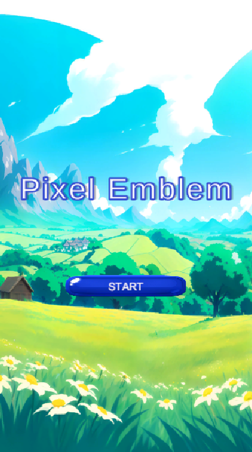
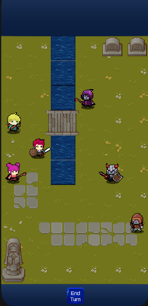
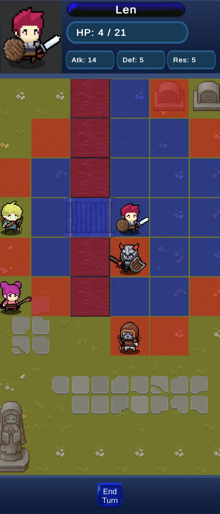
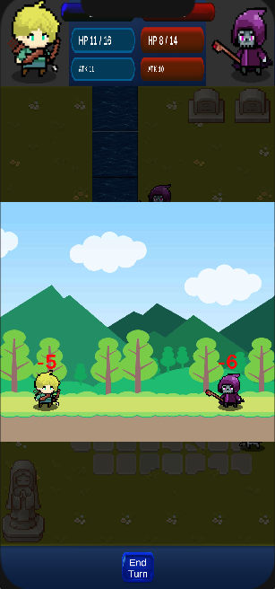
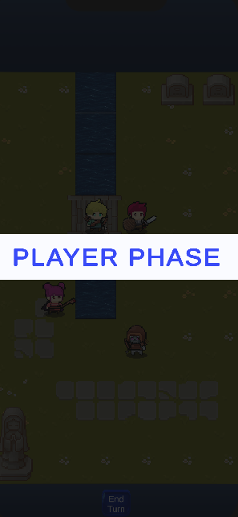
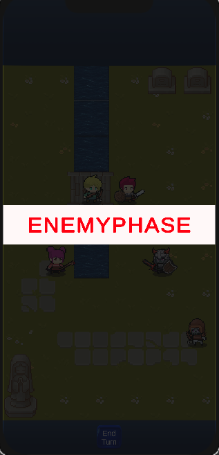
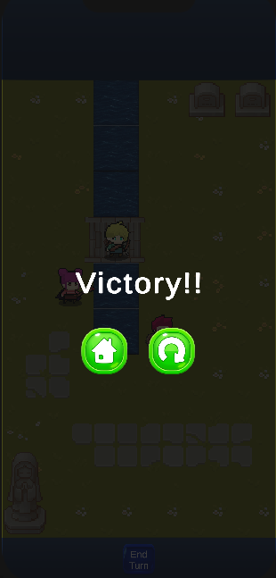
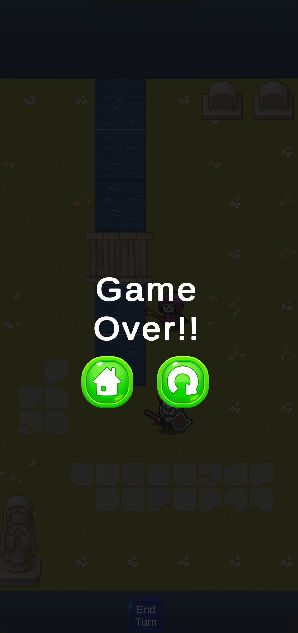

# 🕹️ Pixel Emblem

這是一款使用 Unity 製作的像素風戰棋遊戲。  
玩家操控多位角色在網格地圖上戰鬥，具備回合制系統、攻擊動畫、傷害數字顯示、背景音樂與戰鬥音效。

---

## 🎮 遊戲玩法

- 回合制戰鬥：分為「玩家回合」與「敵人回合」
- 玩家控制隊伍角色移動、攻擊敵人
- 攻擊會觸發戰鬥動畫畫面，顯示雙方傷害數字
- 擁有背景音樂與斬擊、命中等戰鬥音效
- 擊敗所有敵人獲得勝利，隊伍全滅或條件失敗則 Game Over

---

## 📱 支援平台

遊戲支援 **Android 手機版本**  
目前可透過 APK 檔安裝於 Android 裝置，支援直向畫面操作，手指觸控即可完成選擇與指令下達。

👉 前往 [Releases](https://github.com/123Ryo/PixelEmblem/releases/tag/v0.2) 頁面，下載最新 APK 安裝檔案進行體驗 📦

---

## 📂 專案結構簡介

- `Assets/`：主要資源（腳本、音效、角色圖像等）
- `Scripts/`：角色移動、戰鬥邏輯、UI 控制等核心程式碼
- `Scenes/`：包含遊戲主場景、開始畫面等
- `Prefabs/`：角色、地圖元件、戰鬥動畫等預製物件
- `README.md`：本專案說明文件

---

## 🛡️ License

本專案所有原始碼與素材均為作者所有，未經明確書面授權，禁止任何形式的商業使用、重新發布、複製或改作。

非經作者授權，不得將本專案用於個人、商業、學習或教學等任何用途，亦不得以任何形式公開分享或散布本專案檔案。

詳細授權條款請參閱專案根目錄的 LICENSE 文件。

---

## 💡 技術亮點

- C# 程式設計（角色行動、AI 邏輯、戰鬥機制）
- Unity 動畫與特效系統整合
- 攻擊動畫搭配音效與傷害數字
- 自動化勝負條件判定
- 回合切換動畫（PLAYER PHASE / ENEMY PHASE）

---

## 🔧 開發環境

- Unity 2021+
- Visual Studio / Rider
- 支援 Android Build

---

## 🖼️ 遊戲畫面預覽

🎮 遊戲封面  

🧱 戰棋場景與移動範圍顯示  

⚔️ 戰鬥動畫與傷害顯示  

🎲 回合開始畫面  

🏆 勝利畫面  

💀 失敗畫面  

---

## 🎬 遊戲影片展示

👉 [遊戲展示影片](Video/PixelEmblemDemo.mp4)

---

## 👨‍💻 作者

- GitHub 帳號：123Ryo
